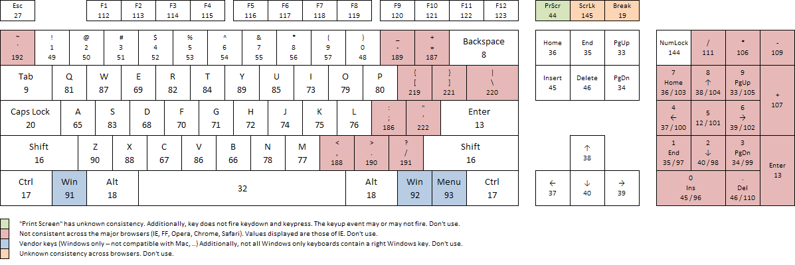

## DOM - Document Object Model

### DOM - Selectors 
1. getElementById('')
2. getElementByTegName('')
3. getElementByClassName('')
4. getElementByName('')
5. qutSelector('')
6. qutSelectorAll('')

- getElementById('')-> bunda biz elamentimizni  " id " nomiorqali tanlab olamiz . 
<p>M :</p>

```
let catd = .document.getElementById('card')
```

- getElementByClassName('')-> bunda biz elamentimizni " class " nomi orqali tanlab olamiz . 
<p>M :</p>

```
let catd = .document.getElementByClassName('card');
```
- getElementByTagName('')-> bunda biz elamentimizni " teg " nomi orqali tanlab olamiz . 
<p>M :</p>

```
let h1 = .document.getElementByTagName('h1');
```

- getElementByName('')-> bunda biz elamentimizni " name " nomi orqali tanlab olamiz . 
<p>M :</p>

```
let catd = .document.getElementName('card');
```
- qutSelector('')-> bunda biz elamentimizni ham " .class , #id , tegName , name " orqali tanlab olishligimiz mumkun  . 
<p>M :</p>

```
let card = document.querySelector(".card");
//----------------------
let card = document.querySelector("#card");
//-----------------------
let card = document.querySelector("h1");
//-------------------------
let card = document.querySelector("card");
```

- qutSelectorAll('')-> bunda biz elamentimizni ham " .class ,  tegName , name " orqali qancha bo'lsa hammasini tanlab  olishligimiz mumkun  . 
<p>M :</p>

```
let card = document.querySelectorALL(".card");
//----------------------
let card = document.querySelectorAll("h1");
//-------------------------
let card = document.querySelectorAll("card");
```

<hr>

### **Tanlab olgan elamentlarimiz ustida bajarishimiz mukun bo'lgan ammallar**

- **element.parentElement** -> bu bizga tanlab olgan elamentimizni parent 'ota' elamentini ko'rsatadi.

- **element.parentElemen.parentElement.parentElement** -> bu bizga tanlab olgan elamentimizni eng katta parent elamentigacha chiqishlik imkonini beradi bu ketma ketlikda yozsak.

- **element.parentNode** -> bu ham bizga *.parentElement* kabi vazifa bajaradi

- **element.nextElementSibling** -> bu bizga tanlab olgan elamentimizdan kegingi elamentni ko'rsatadi.

- **element.previosElementSibling** -> bu bizga tanlab olgan elamentimizdan oldingi elamentni ko'rsatadi.

- **element.chidren** -> bu bizga tanlab olgan elamentimizni icidagin 'bola' elamentini ko'rsatadi.

- **element.firstElementChild** -> bu bizga tanlab olgan elamentimizni ichidagi birinchi  elamentni ko'rsatadi.

- **element.lastElementChild** -> bu bizga tanlab olgan elamentimizni ichidagi ohirgi  elamentni ko'rsatadi.

- **element.style** -> bu bizga tanlab olgan elamentimiz olishi mumkun bo'lga barcha srillarni ( *Object { }*) ro'yhat korinishida ko'rishligimiz mumkun va shu orqali elamentimizni manipulatsiya yani stillarni o'zgartiishimiz yoki qo'shimcha yana stillar qo'shishligimiz mumkun.
<p>M : </p>

```
let element = document.querySelector("h1");
element.style.color = "red";
```
<hr>

### 30.01.2024

- **element.style.cssText** -> foydalangan holda js orqali elamentimizga istakgancha stillarni yozishligimiz mumkun , bunda agr (" " , ' ') qo'shtirnoq va birtirnoqni ichida yozadigan bo'lsak 1 qatorda yozishligimiz kerak agar (` `) bektik ichida yozadigan bo'lsak ancha tartipli ko'rinishda yozishlik imkoni mavjut. 

### JavaScript orqali tanlab olgan elamentlarimizni vizini aniqlash 

1.  .clientWidth
2.  .clientHeeight
3.  .offsetHeeight
4.  .offseWidht
6.  .scrolHeeight
7.  .offsetTop
8.  .offsetLeft
 <hr>

 - **element.clientWidth** - tanlab olgan elamentimiz Width aniqlab beradi bunda borderlar hisomlanmaydi misol tariqasida cardni olsak uni borderi , margin lar hisonlanmastan  Width o'lchab beradi va bizga number qaytaradi. 

 - **element.clientHeeight** - elamentimiz balandligini o'lchab beradi huddi element.clientWidth singari

 - **element.offseWidht** - elamentimizni obshi Width olchab beradi bunda peding , border , scrol bo'lsa ularniham hisoblab beradi va bu ham number qaytaradi.

  - **element.offsetHeeight** - elamentimiz  obshi balandligini o'lchab beradi huddi element.offseWidht singari.

  - **element.scrolHeeight** - elamentimiz  skroli bo'lsa shunin o'lchab beradi .

- **element.offsetTop** - elamentimizni tepadan qancha joy bo'lsa shuni o'lchab beradi.

- **element.offsetLeft** - elamentimizni chaptan (leftan) qancha joy bo'lsa shuni o'lchab beradi.

<hr>

### JavaScripta elament atributlari bilan ishlashlik.

1. getAttribute("");
2. setAttribute("" , "");
1. hasAttribute("");

- **elament.getAttribute("");** - bunda kiritgan elament atribut velyusini olib beradi .

- **elament.setAttribute("","");** - bunda metod oz'ziga ikkita qiymat oladi birinchisi o'zgartirmoqchi bo'lgan atributimiz , ikkinchiqiymat sifatida nimga o'zgartirmoqchi bo'lsak shuni yozamiz.

- **elament.hasAttribute("");** - bunda kiritgan elament atribut tekshiradi bo'lsa true aks holda false qiymat qaytaradi .
<hr>

### JavaScrip da classlar bilan islashlik 

1. className
2. classList

- **elament.className** - bu elamentimiz class nomini olib beradi .

- **elament.classList** - bu bizga lamentimizdagi class larni ro'yhatini array "[ ]" ko'rinishida olib beradi va ozini metodlariga ega ular .  

   - .add()
   - .remove()
   - .contains()
   - .toggle()

     - **elament.classList.add("")** - bu elament classiga kiritga classimizni ko'shadi .

      - **elament.classList.remove("")** - bu elament classlari ichidan kiritgan classimizni o'chiradi  .

       - **elament.classList.contans("")** - bu elament ichida biz kiritgan class bo'lsa true aks holda false qiymat qaytaradi.

        - **elament.classList.toggle("")** - bu biz kiritgan classimiz elamentlar classi ichida bo'lsa o'chiradi , agar yoq bo'lsa qo'shadi.

<hr> 

###  31. 01. 2024

###  Dynamicolly DOM monupulating

 - createElement(tegName);
 - appennd();
 - prepend();
 - after();
 - before();


 1. **createElement(tegName)** -> bizga yangi html elament qurib beradi .

 ```
 let div = document.createElement(div);

 // natija -> <div></div>
 ``` 

 2. **appennd()** -> yaratgan elamentimizni tanlab olgan elamentimiz ichiga joylashtirib beradi , joylashtirishda elamentimizni ohiridan joylashtiradi.

```
let wrapper =document.querySelector('.wrapper');
let card = document.createElement('div');

wrapper.append(card);
```

 3. **prepend()** -> yaratgan elamentimizni tanlab olgan elamentimiz ichiga joylashtirib beradi , huddi 'appennd()' singari farqi bunda joylashtirishda elamentimiz boshidan  joylashtiradi, ikkisini bir vaqitda ishlatilmaydi .

```
 let wrapper =document.querySelector('.wrapper');
  let card = document.createElement('div');

  wrapper.prepend(card);
```
 
 4. **after()** -> yaratgan elamentimizni tanlab olgan elamentimizni pasidan qo'shib beradi.

 
```
   let wrapper=document.querySelector('.wrapper');
   let card = document.createElement('div');

   wrapper.after(card);
 ```

5 . **before()** -> yaratgan elamentimizni tanlab olgan elamentimizni yuqorisidan qo'shib beradi.

```
    let wrapper =document.querySelector('.wrapper');
    let card = document.createElement('div');

    wrapper.before(card);
  
```
<hr>

###  1. 02. 2024

### DOM Events 

- **Events** -> Hodisa 

- **addEventListene()** -> hodisani kuzatib turish , bu o'ziga 3 ta qiymat oladi , lekin ko'pincha 2 ta qiymat beriladi . 1- qiymat sifatida o'ziga hodisa nomini oladi (click , dblclick ,....) , 2- qiymat sifatida esa biz kiritga hodisa yuz berganda bjarilishi kerak bo'lgan funcsiya qiymat sifatida olinadi .

<p>M :</p>

```
let modalWrapper = document.querySelector(".modal_wrapper"),
kirish=document.querySelector("#kirish"),
chiqish=document.querySelector("#chiqish");


kirish.addEventListener("click",()=>{
    modalWrapper.style.display = "block";
    document.body.style.overflow = "hidden";
})


chiqish.addEventListener("click",()=>{
    modalWrapper.style.display = "none";
    document.body.style.overflow = "visible";
});
```

### Mouse events

- **click**
- **dblclick**
- **mouseleave**
- **mousemove**
- **mousedown**
- **mouseleave**
- **mouseente**
- **mouseup**

1. - **click** -> mishkani tanlab olgan elamentimiz ustida 1 marotaba bosishlik hodisasi .

2. - **dblclick** -> mishkani tanlab olgan elamentimiz ustida 2 marotaba bosishlik hodisasi .

3. - **mouseleave** -> mishkani tanlab olgan elamentimiz ustiga olib borgandagi hpodisa .

4. - **mousemove** -> mishkani tanlab olgan elamentimiz ustidan olib qochkanimizda , yani boshqa joyga yo'naltirganimizda yuz beruvchi hodisa .

5. - **mouseleave** -> mishkani tanlab olgan elamentimiz ustida harakatlangan vaqti , bunda mishka tanlab olgan elamentimiz ustida qancha harakat qilsa kiritga funcsiyamiz shuncha marotaba ish bajaradi.

6.  - **mousedown** -> mishkani knopkasi bosilgandagi holat.

7.  - **mouseenter** -> ustiga borganda ishlaydi

6.  - **mouseup** -> mousedown ni  teskarisi.

### Keyboard events
- **keydown**
- **keypress**
- **keyup**

1. - **keydown** -> harbitta kno'pkani bosilishi .

2. - **keypress** -> ( keydown ) bilan birhil ishlaydi faqat bir marotaba bossganda gina ishlaydi.

3. - **keyup** -> bironbir tugmani bosib qo'yinb yubiorishligimiz bilan ishlaydi , va eng tez ishlaydigani ham shu hisoblanadi.

```
// event.target.velyu -> bu har bir hodisa yuz berganda nima bosilganligi haqida habar beruvchi yoki bo'lmasam aytishligimiz mumkun bironbir tugmachani yoki qandaydur elamentni bosganligimizda uning velyusini , qiymaini ko'rsatib beradi

```

```
// event.cod.js -> klavyaturadagi har bir kono'pkani o'z son (raqami) cod sifatida mavjut  jsda.

//event.ceyCode
```

### ceyCod :  


<hr>

#### DOM contene loadede -> Documentimizdagi (html) hamma narsa yuclanib bio'lgandan kegin ishlaydiga event.

#### Loaded -> Umumiy ' DOM 'degi narsalar yuklanish hodisasi

#### Resize -> hayitni kichrayib katayishdagi hodisa , vizni boshqarishdagi .

#### Scrole -> scrol 📜
<hr>
 
### setTimeout ( () => {} , 1000);  -> JavaScriptni o'zini funcsiyasi bo'lib , argument sifatida funcsiya va tayim (vaqit "1000 mls") kiritiladi .

### setInterval ( () => {} , 1000);

```
let loadWrapper = document.querySelector('.load_wrapper');

window.addEventListener('DOMContentLoaded',()=>{
    loadWrapper.style.display = 'flex';
    document.body.style.overflow="hidden";
});

window.addEventListener('load',()=>{

    setTimeout( ()=>{

        loadWrapper.style.display = 'none';
        document.body.style.overflow="visible";

    } , 2000)
  
});
```
<hr>
### 2. 02. 2024 
### JSON -> javascript object nototion  - API , config file uchun ishlatiladi

### API - Api progrsamming inteerface -> Frontend va Becend orasidagi yo'l .

### JSON Methods

1. - **json.strinfy()** -> kiritgan o'zgaruvchimiz array , object , number , boolin  harqandek tipda bo'lishidan qatti nazar bizga **stringa** o'girib beradi.

2. - **json.parse()** ->  **stringdan** avvalgi holatiga qaytaradi , o'zgaruvchimiz array , object , number yoki boshqa tipta bo'lgan bo'lsa avalgi haoliga qaytaradi .

### BROWSER STORAGE

1.  **Locolstoragr**
2.  **Sessiontoragr**
3.  **Cookies**

-  **Locolstoragr** -> O'chami 10 MB , yashash davri cheksiz hich qachon o'chmaydi toki o'zimiz o'chirmagunimzgacha .

-  **Sessiontoragr** -> O'chami 5 MB , yashash davri tab bosib ili (x) bosib sayitdan chiqip ketgungacha ishlaydi ,saqlanadi .

- **Cookies** -> O'lchami 4 KB , yashash davri , saqlash mudati o'zimiz kiritgan vaqitgacha saqlanadi (1 hafta , 1 oy , 1 yil , 100 yil , 100000 yil ,........) .

### METHODS

-  **.setItim(q)**
-  **.getItim(q)**
-  **.removeItim(q)**
-  **.clear()**

1. - **LocalStrage.setItim(q)** ->Malumotni Saqlash yoki Q'shish ->  bu metod o'ziga 2 ta qiymat oladi , 1- qiymat sifatida biz berga nom ihtiyori , 2- qiymat saqlamoqchi yoki qoshmoqchi bolgan o'zgaruvchimiz kiritiladi u (number , array , object , boolin ) tibida bo'lsa sozsiz stringga o'girib olishimiz shart **json.strinfy()** yordamida .

2. - **LocalStrage.getItim(q)** -> Bu meto'd saqlangan malumotni olishlik uchun u oziga qiymat sifatida kiritishda bergan nomimiz oladi va shu nom ostidagi malumotni chiqarib beradi.

3. - **LocalStrage.removeItim(q)** -> Bu metod hotiradan saqlangan maklumotni o'chitish uchun ishlatiladi , o'ziga qiymat sifatida kiritishda bergan nomimiz oladi va shu nom ostidagi malumotni o'chiradi .

4. - **LocalStrage.clear()**  -> Bu ham o'chioradi va qiymat olmaydi sabbab hammasini o'chirib butunlay tozalab yuboradi .

